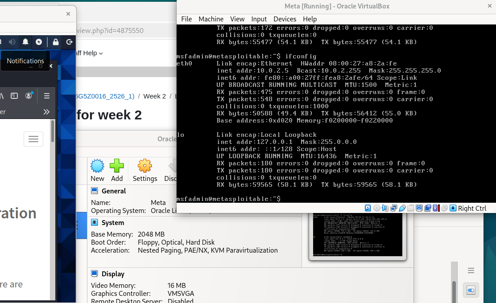
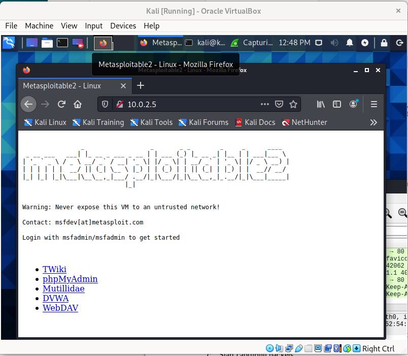
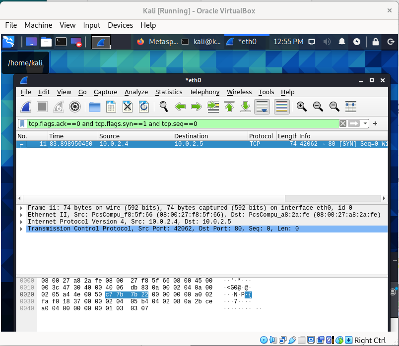
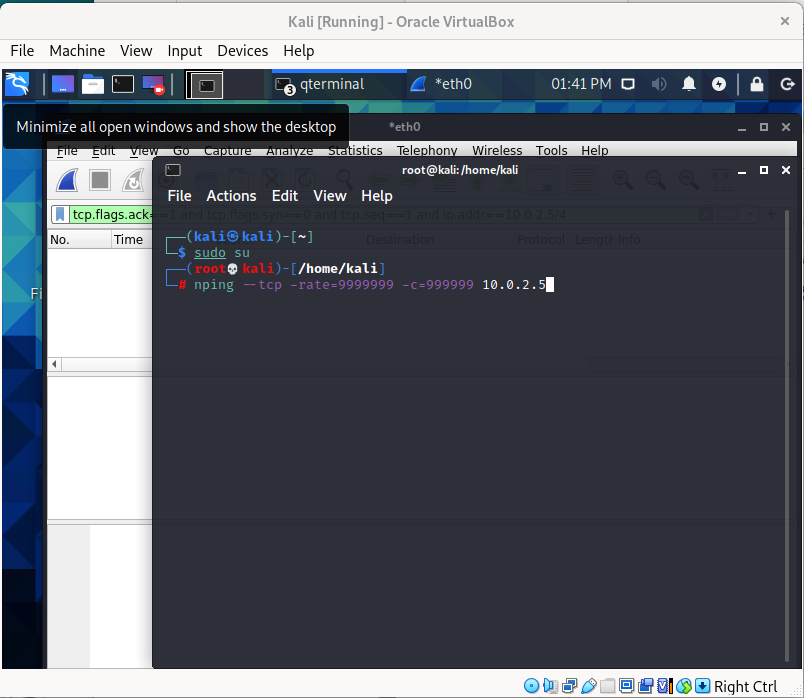
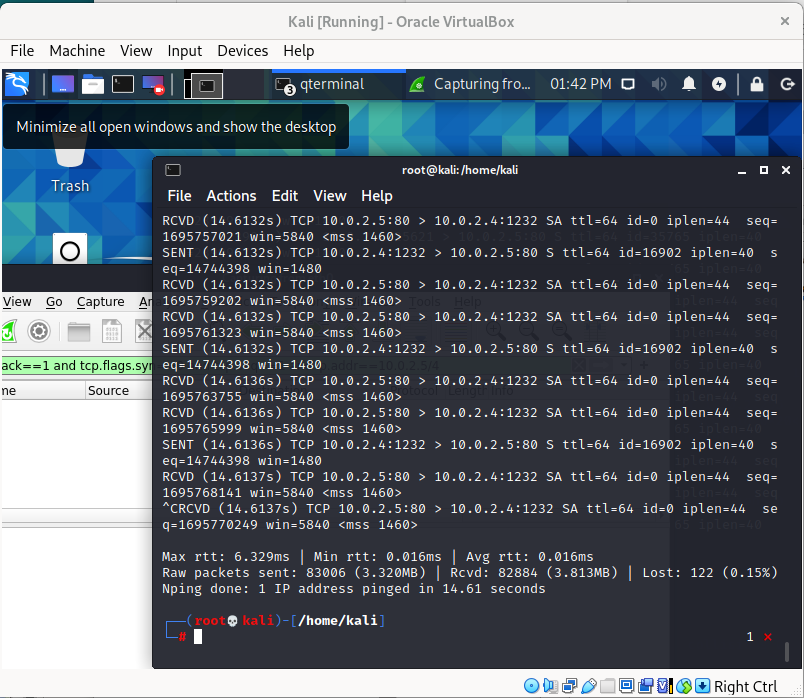
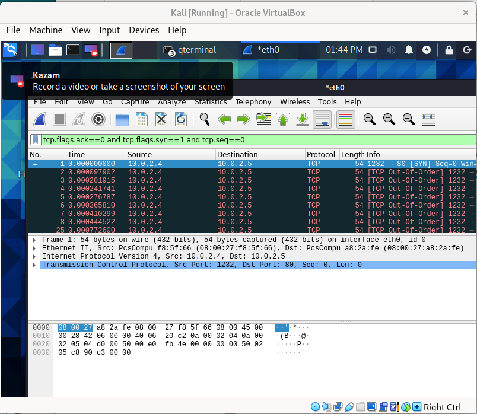

# Wireshark — TCP Three-Way Handshake & SYN-Flood (University Lab)

**Source:** Manchester Metropolitan University — Lab exercise  
**Date:** 2025-10  
**Objective:** Capture and inspect the TCP three-way handshake between Kali and Metasploitable, then observe the effect of a simulated SYN flood in an isolated VM lab environment.

---

> **NOTE:** This README references the screenshots as `Sc1.png` ... `Sc6.png`. If your uploaded files use a different extension (e.g., `.jpg`), update the filenames below to match.

---

## Short summary
This lab demonstrates two exercises performed in isolated virtual machines (Kali, Metasploitable):

1. Capture and inspect the **TCP three-way handshake** (SYN → SYN/ACK → ACK).  
2. Run a controlled SYN-flood simulation in the lab and observe how it increases SYN traffic and affects normal handshakes.

All captures and tests were carried out only in the VM lab environment. No public or production systems were targeted.

---

## Steps performed
1. Booted Kali and Metasploitable VMs and confirmed network interface (see screenshot).  
2. Started Wireshark on Kali and began capture on the active interface.  
3. Opened a browser in Kali and navigated to the Metasploitable IP to generate a normal TCP handshake.  
4. Applied this display filter to isolate initial SYN packets:
tcp.flags.ack == 0 && tcp.flags.syn == 1 && tcp.seq == 0
   (This highlights packets that initiate connections.) See the filter result below.  
5. For the lab attack exercise only, a controlled packet generator in the isolated lab produced many SYN packets against Metasploitable; Wireshark captured the spike in SYN traffic and many half-open/failed connections. See screenshots.  
6. Stopped captures, documented observations, and restored VMs to a clean state.

---

## Key learning points
- **Three-way handshake:** SYN → SYN/ACK → ACK establishes a TCP session.  
- **Wireshark filters** are essential for isolating packet types and troubleshooting.  
- **SYN flood effects:** Excess SYNs create half-open connections; mitigation includes SYN cookies, connection limits and rate-limiting.  
- **Ethics:** Conduct active tests only in authorised, isolated lab environments.

---

## Screenshots
*(All screenshots have sensitive values redacted and are from an isolated VM lab.)*

  
*Figure 1 — Metasploitable interface showing IP (redacted).*

  
*Figure 2 — Browser request from Kali to Metasploitable (lab only).*

  
*Figure 3 — Wireshark display filter isolating SYN packets.*

  
*Figure 4 — Packet details pane showing SYN flags and headers (redacted).*

  
*Figure 5 — Terminal showing controlled packet generation in the lab (redacted).*

  
*Figure 6 — Spike of SYN packets captured during lab-only SYN flood simulation.*

---

## Safety & ethics
- **Do not** publish runnable attack commands or flags.  
- All active testing documented here was performed in VM lab environments only.  
- If you reproduce the exercise, do so in an isolated environment and obtain permission.
